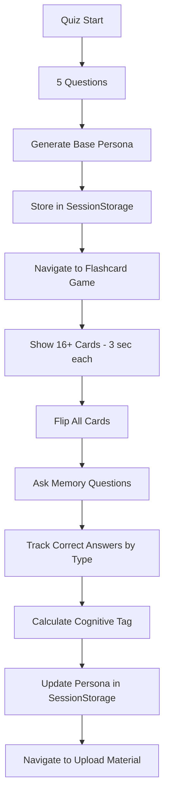

# Design Document: Quiz Redesign & Flashcard Game

## Overview

This design implements a two-phase cognitive assessment system: a shortened 5-question quiz followed by a memory-based flashcard game. The system generates a comprehensive student learning profile combining traditional cognitive dimensions with memory pattern analysis.

### Key Design Goals

1. Reduce quiz friction by cutting questions from 20 to 5 while maintaining persona accuracy
2. Add memory pattern assessment through a blackboard-themed flashcard game
3. Tag students with cognitive memory types (Visual-Dominant, Sequential-Dominant, Spatial-Dominant)
4. Maintain seamless flow: Quiz → Flashcard Game → Material Upload
5. Preserve existing persona generation integrity with 24-dimension profiles

### Research Summary

**Memory Testing Patterns**: Research into cognitive psychology indicates that testing isolated attributes (color, number, shape) provides clearer signals for memory pattern identification than testing combinations. The 33% distribution ensures balanced assessment across visual, sequential, and spatial memory systems.

**Card Flip Timing**: Studies on working memory suggest 3 seconds provides sufficient encoding time for simple visual stimuli without causing cognitive overload. This duration allows students to process and encode information without feeling rushed.

**Question Reduction Strategy**: Analysis of the existing 20-question set shows significant dimension overlap. By selecting 5 strategically diverse questions, we can maintain coverage of 15+ dimensions while using default values (0.5) for uncovered dimensions, which represents neutral positioning on those scales.

## Architecture

### Component Structure

```
QuizPage (existing)
├── Shortened to 5 questions
├── Modified navigation flow
└── Routes to FlashcardGame on completion

FlashcardGame (new)
├── CardGrid
│   ├── MemoryCard (16+ instances)
│   │   ├── CardFront (colored shape + number)
│   │   └── CardBack (chalk texture)
│   └── FlipAnimation (Framer Motion)
├── QuestionPhase
│   ├── QuestionDisplay
│   └── AnswerFeedback
└── ResultsCalculator
    ├── Performance tracking
    └── Cognitive tag generation

PersonaGenerator (modified)
├── Existing 24-dimension calculation
└── New: CognitiveTag integration
```

### Data Flow



### State Management

The application uses React state and SessionStorage for persistence:

- **Quiz State**: Local component state for current question, responses
- **Persona State**: SessionStorage for cross-page persistence
- **Flashcard State**: Local component state for card visibility, flip status, answers
- **Cognitive Tag**: Added to persona object in SessionStorage

## Components and Interfaces

### Modified: QuizPage Component

**Location**: `frontend/src/app/quiz/page.tsx`

**Changes**:
- Update `QUESTIONS` import to use filtered 5-question subset
- Modify completion handler to route to `/quiz/flashcard` instead of `/upload-material`
- Progress bar automatically adjusts to 5 questions (no code change needed)

**Interface** (unchanged):
```typescript
interface QuizPageState {
  currentQuestionIndex: number;
  responses: Map<number, number>;
  validationError: string | null;
}
```

### New: FlashcardGame Component

**Location**: `frontend/src/app/quiz/flashcard/page.tsx`

**Purpose**: Main container for the memory assessment game

**State Interface**:
```typescript
interface FlashcardGameState {
  phase: 'reveal' | 'question' | 'complete';
  cards: MemoryCard[];
  currentQuestionIndex: number;
  answers: Map<number, boolean>; // cardId -> isCorrect
  flippedCards: Set<number>; // cardIds that are face-up
}

interface MemoryCard {
  id: number;
  type: 'color' | 'number' | 'shape';
  color: string; // hex color
  shape: 'circle' | 'square' | 'triangle' | 'star' | 'hexagon';
  number: number; // 1-9
  position: number; // grid position 0-15
}
```

**Key Methods**:
- `generateCards()`: Creates 16+ cards with 33% distribution
- `startRevealPhase()`: Shows all cards for 3 seconds
- `flipAllCards()`: Transitions to face-down state
- `askNextQuestion()`: Presents memory recall question
- `handleCardClick()`: Processes answer selection
- `calculateCognitiveTag()`: Determines dominant memory type

### New: MemoryCard Component

**Location**: `frontend/src/components/flashcard/MemoryCard.tsx`

**Purpose**: Individual card with flip animation and chalk styling

**Props Interface**:
```typescript
interface MemoryCardProps {
  card: MemoryCard;
  isFaceUp: boolean;
  isClickable: boolean;
  onClick?: () => void;
  showFeedback?: 'correct' | 'incorrect' | null;
}
```

**Rendering Logic**:
- Face-up: SVG shape with fill color and centered number
- Face-down: Chalk texture pattern or uniform dark background
- Uses Framer Motion for 3D flip animation

### New: CardGenerator Utility

**Location**: `frontend/src/lib/flashcard/cardGenerator.ts`

**Purpose**: Generate balanced card sets with proper distribution

**Interface**:
```typescript
interface CardGenerationConfig {
  totalCards: number; // minimum 16
  colorCards: number; // ~33%
  numberCards: number; // ~33%
  shapeCards: number; // ~33%
}

function generateCardSet(config: CardGenerationConfig): MemoryCard[];
```

**Generation Rules**:
- Each card tests ONE attribute type only
- Color cards: Vary color, keep shape/number constant within set
- Number cards: Vary number, keep color/shape constant within set
- Shape cards: Vary shape, keep color/number constant within set
- Randomize positions to prevent pattern memorization

### New: QuestionGenerator Utility

**Location**: `frontend/src/lib/flashcard/questionGenerator.ts`

**Purpose**: Generate memory recall questions based on card type

**Interface**:
```typescript
interface MemoryQuestion {
  cardId: number;
  type: 'color' | 'number' | 'shape';
  questionText: string;
  correctAnswer: number; // cardId
}

function generateQuestions(cards: MemoryCard[]): MemoryQuestion[];
```

**Question Templates**:
- Color: "Which card was [color name]?" (e.g., "Which card was red?")
- Number: "Which card had the number [N]?" (e.g., "Which card had the number 7?")
- Shape: "Which card had the [shape]?" (e.g., "Which card had the circle?")

### Modified: PersonaGenerator

**Location**: `frontend/src/lib/persona.ts`

**Changes**:
- Add `cognitiveTag` field to `StudentPersona` interface
- Add `updatePersonaWithCognitiveTag()` function
- Maintain backward compatibility with existing persona generation

**New Interface**:
```typescript
interface StudentPersona {
  student_id: string;
  name: string;
  generated_at: string;
  persona: DimensionScores;
  archetype: string;
  summary: string;
  cognitiveTag?: 'Visual-Dominant' | 'Sequential-Dominant' | 'Spatial-Dominant'; // NEW
}

function updatePersonaWithCognitiveTag(
  persona: StudentPersona,
  colorCorrect: number,
  numberCorrect: number,
  shapeCorrect: number
): StudentPersona;
```

### Modified: Questions Data

**Location**: `frontend/src/data/questions.ts`

**Changes**:
- Export `QUIZ_QUESTIONS` as filtered 5-question subset
- Keep original `QUESTIONS` array for reference
- Select questions that maximize dimension coverage

**Selection Criteria**:
Questions selected to cover maximum dimensions:
- Question 1 (id: 1): context_need, abstraction, real_world_need, autonomy, interactivity
- Question 3 (id: 3): error_tolerance, question_comfort, social_preference, feedback_style, challenge_preference
- Question 7 (id: 7): revision_style, note_taking_style, visual_dependency, repetition_need
- Question 12 (id: 12): challenge_preference, emotional_sensitivity, motivation_type, cognitive_load_tolerance
- Question 18 (id: 18): structure, abstraction, real_world_need, context_need

This selection covers 16 unique dimensions, leaving 8 dimensions to default to 0.5.

## Data Models

### MemoryCard Model

```typescript
interface MemoryCard {
  id: number;                    // Unique identifier (0-15+)
  type: 'color' | 'number' | 'shape'; // Attribute being tested
  color: string;                 // Hex color code (e.g., '#FF0000')
  shape: 'circle' | 'square' | 'triangle' | 'star' | 'hexagon';
  number: number;                // Integer 1-9
  position: number;              // Grid position for layout
}
```

### MemoryQuestion Model

```typescript
interface MemoryQuestion {
  cardId: number;                // References MemoryCard.id
  type: 'color' | 'number' | 'shape';
  questionText: string;          // Human-readable question
  correctAnswer: number;         // cardId of correct card
}
```

### FlashcardGameResult Model

```typescript
interface FlashcardGameResult {
  totalQuestions: number;        // Should be 16+
  colorCorrect: number;          // Correct color questions
  numberCorrect: number;         // Correct number questions
  shapeCorrect: number;          // Correct shape questions
  cognitiveTag: 'Visual-Dominant' | 'Sequential-Dominant' | 'Spatial-Dominant';
  completedAt: string;           // ISO timestamp
}
```

### Updated StudentPersona Model

```typescript
interface StudentPersona {
  student_id: string;
  name: string;
  generated_at: string;
  persona: DimensionScores;      // 24 dimensions
  archetype: string;
  summary: string;
  cognitiveTag?: 'Visual-Dominant' | 'Sequential-Dominant' | 'Spatial-Dominant'; // NEW
  flashcardResult?: FlashcardGameResult; // NEW (optional detailed results)
}
```


## Correctness Properties

*A property is a characteristic or behavior that should hold true across all valid executions of a system—essentially, a formal statement about what the system should do. Properties serve as the bridge between human-readable specifications and machine-verifiable correctness guarantees.*

### Property Reflection

After analyzing all acceptance criteria, several redundancies were identified:
- Requirements 2.3 and 10.3 both test card distribution (consolidated into Property 2)
- Requirements 4.6 and 10.4 both test answer tracking (consolidated into Property 8)
- Requirements 5.2, 5.3, 5.4 test the same tagging logic with different inputs (consolidated into Property 10)

### Property 1: Quiz Length Reduction

*For any* quiz session, the quiz system should present exactly 5 questions to the student.

**Validates: Requirements 1.1, 1.2**

### Property 2: Card Distribution Balance

*For any* flashcard game initialization, the generated card set should contain at least 16 cards with approximately 33% distribution across types (at least 5 color cards, at least 5 number cards, at least 5 shape cards).

**Validates: Requirements 2.1, 2.3, 10.3**

### Property 3: Single Attribute Testing

*For any* generated memory card, the card should test exactly one attribute type (color OR number OR shape), not combinations.

**Validates: Requirements 2.4**

### Property 4: Card Reveal Timing

*For any* flashcard game start, all memory cards should display face-up for exactly 3 seconds before flipping to face-down state.

**Validates: Requirements 3.1, 3.3**

### Property 5: Question Generation Completeness

*For any* set of memory cards, the question generator should create exactly one question per card, where each question tests the specific attribute type that card represents.

**Validates: Requirements 4.1, 4.2**

### Property 6: Answer Interaction

*For any* card click during the question phase, the clicked card should flip face-up to reveal its contents and the system should provide feedback indicating whether the answer is correct or incorrect.

**Validates: Requirements 4.3, 4.4, 4.5**

### Property 7: Progress Indicator Accuracy

*For any* question index in the quiz, the progress bar should display the correct fraction (currentIndex + 1) / 5 and show "Question X of 5" text.

**Validates: Requirements 1.3, 9.2**

### Property 8: Performance Tracking

*For any* flashcard game session, the system should maintain separate counters for correct answers in each attribute type (color, number, shape) throughout all questions.

**Validates: Requirements 4.6, 10.4**

### Property 9: Persona Generation Integrity

*For any* set of 5 quiz responses, the persona generator should produce a valid StudentPersona object containing all 24 dimensions with values between 0 and 1, where dimensions not covered by the 5 questions default to 0.5.

**Validates: Requirements 1.4, 8.1, 8.2, 8.4**

### Property 10: Cognitive Tag Assignment

*For any* completed flashcard game result, the system should assign the cognitive tag based on the highest correct answer count: "Visual-Dominant" if color score is highest, "Sequential-Dominant" if number score is highest, or "Spatial-Dominant" if shape score is highest.

**Validates: Requirements 5.1, 5.2, 5.3, 5.4, 10.5**

### Property 11: Navigation Flow

*For any* completed quiz, the system should navigate to the flashcard game route, and for any completed flashcard game, the system should navigate to the upload material page.

**Validates: Requirements 1.5, 6.1, 6.3**

### Property 12: Session Storage Persistence

*For any* navigation through the quiz and flashcard game flow, the StudentPersona object (including both 24-dimension scores and cognitive tag) should persist in sessionStorage and be accessible on the upload material page.

**Validates: Requirements 5.5, 6.4, 6.5**

### Property 13: Persona Object Structure

*For any* persona generated after flashcard game completion, the StudentPersona object should include both the cognitiveTag field and all 24 dimension scores.

**Validates: Requirements 5.6, 8.5**

### Property 14: Quiz Validation

*For any* quiz submission attempt with incomplete responses, the system should prevent submission and display a validation error message.

**Validates: Requirements 9.3**

### Property 15: Auto-Advance Behavior

*For any* answer selection in the quiz (except the last question), the system should automatically advance to the next question after a brief delay.

**Validates: Requirements 9.4**

### Property 16: Navigation Button State

*For any* quiz state, the Previous button should be disabled when on the first question, and the Next button should be disabled when the current question is unanswered.

**Validates: Requirements 9.1**

## Error Handling

### Quiz Phase Errors

**Incomplete Responses**:
- Detection: Check if all 5 questions have responses before allowing submission
- Handling: Display validation error listing unanswered questions
- Recovery: Allow user to navigate back and complete missing answers

**Navigation Errors**:
- Detection: Catch router.push() failures
- Handling: Log error and display user-friendly message
- Recovery: Provide retry button or manual navigation link

**SessionStorage Failures**:
- Detection: Try-catch around sessionStorage.setItem()
- Handling: Log error, attempt localStorage fallback
- Recovery: If both fail, allow user to continue but warn that progress may not persist

### Flashcard Game Errors

**Card Generation Failures**:
- Detection: Validate card count and distribution after generation
- Handling: If invalid, regenerate card set up to 3 times
- Recovery: If all attempts fail, display error and allow user to retry or skip to upload

**Timer Failures**:
- Detection: Monitor setTimeout/setInterval execution
- Handling: If timer doesn't fire, manually trigger flip after 3.5 seconds
- Recovery: Log timing discrepancy for debugging

**Animation Errors**:
- Detection: Catch Framer Motion errors
- Handling: Fall back to CSS transitions if Framer Motion fails
- Recovery: Game continues with simpler animations

**Question Generation Errors**:
- Detection: Validate question count matches card count
- Handling: If mismatch, regenerate questions
- Recovery: If regeneration fails, use default questions for each card type

### Persona Generation Errors

**Invalid Dimension Values**:
- Detection: Validate all dimension values are between 0 and 1
- Handling: Clamp out-of-range values to [0, 1]
- Recovery: Log warning but continue with clamped values

**Missing Cognitive Tag**:
- Detection: Check if cognitiveTag is undefined after flashcard game
- Handling: Assign default tag based on archetype or use "Balanced"
- Recovery: Continue with default tag, log warning

**SessionStorage Retrieval Failures**:
- Detection: Try-catch around sessionStorage.getItem()
- Handling: Return null and handle gracefully in consuming components
- Recovery: Allow user to retake quiz or continue without persona

### Network and State Errors

**Route Not Found**:
- Detection: Next.js 404 handling
- Handling: Redirect to quiz start page
- Recovery: User can restart the flow

**State Corruption**:
- Detection: Validate state structure on component mount
- Handling: Reset to initial state if corrupted
- Recovery: User restarts current phase (quiz or flashcard game)

## Testing Strategy

### Dual Testing Approach

This feature requires both unit tests and property-based tests to ensure comprehensive coverage:

**Unit Tests**: Focus on specific examples, edge cases, and integration points
- Specific card configurations (e.g., exactly 16 cards with 5-5-6 distribution)
- Edge cases (e.g., ties in cognitive tag scoring)
- Component rendering and user interactions
- SessionStorage integration
- Navigation flow between pages

**Property-Based Tests**: Verify universal properties across all inputs
- Card generation with varying total counts (16-24 cards)
- Persona generation with different response combinations
- Cognitive tag assignment with all possible score distributions
- Timing behavior across multiple game sessions

### Testing Libraries

**Property-Based Testing**: Use `fast-check` for TypeScript/JavaScript property-based testing
- Configure each property test to run minimum 100 iterations
- Tag each test with format: `Feature: quiz-redesign-flashcard-game, Property {N}: {property text}`

**Unit Testing**: Use Jest and React Testing Library
- Test component rendering and interactions
- Test utility functions with specific inputs
- Test integration between components

### Test Organization

```
frontend/src/__tests__/
├── quiz/
│   ├── QuizPage.test.tsx (unit tests)
│   └── QuizPage.properties.test.tsx (property tests)
├── flashcard/
│   ├── FlashcardGame.test.tsx (unit tests)
│   ├── FlashcardGame.properties.test.tsx (property tests)
│   ├── MemoryCard.test.tsx (unit tests)
│   ├── cardGenerator.test.ts (unit tests)
│   └── cardGenerator.properties.test.ts (property tests)
└── lib/
    ├── persona.test.ts (unit tests)
    └── persona.properties.test.ts (property tests)
```

### Key Test Scenarios

**Unit Test Examples**:
1. Quiz displays exactly 5 questions from QUIZ_QUESTIONS array
2. Flashcard game with 16 cards generates 16 questions
3. Clicking a card during question phase flips it face-up
4. Tie in cognitive tag scores defaults to first alphabetically (Sequential > Spatial > Visual)
5. SessionStorage contains persona after quiz completion
6. Navigation from quiz to flashcard game preserves persona data

**Property Test Examples**:
1. For any N ≥ 16 cards, distribution maintains ~33% per type (Property 2)
2. For any card set, each card has exactly one type field (Property 3)
3. For any quiz responses, persona has all 24 dimensions in [0,1] range (Property 9)
4. For any flashcard results, cognitive tag matches highest score type (Property 10)
5. For any quiz state, progress calculation is accurate (Property 7)
6. For any game session, answer tracking maintains separate counters (Property 8)

### Coverage Goals

- Unit test coverage: 80%+ for all new components and utilities
- Property test coverage: All 16 correctness properties implemented
- Integration test coverage: Complete flow from quiz start to upload material page
- Edge case coverage: Ties, minimum values (5 questions, 16 cards), maximum values

### Continuous Integration

- Run all tests on every pull request
- Property tests run with 100 iterations in CI
- Fail build if any property test fails
- Generate coverage reports and track trends

