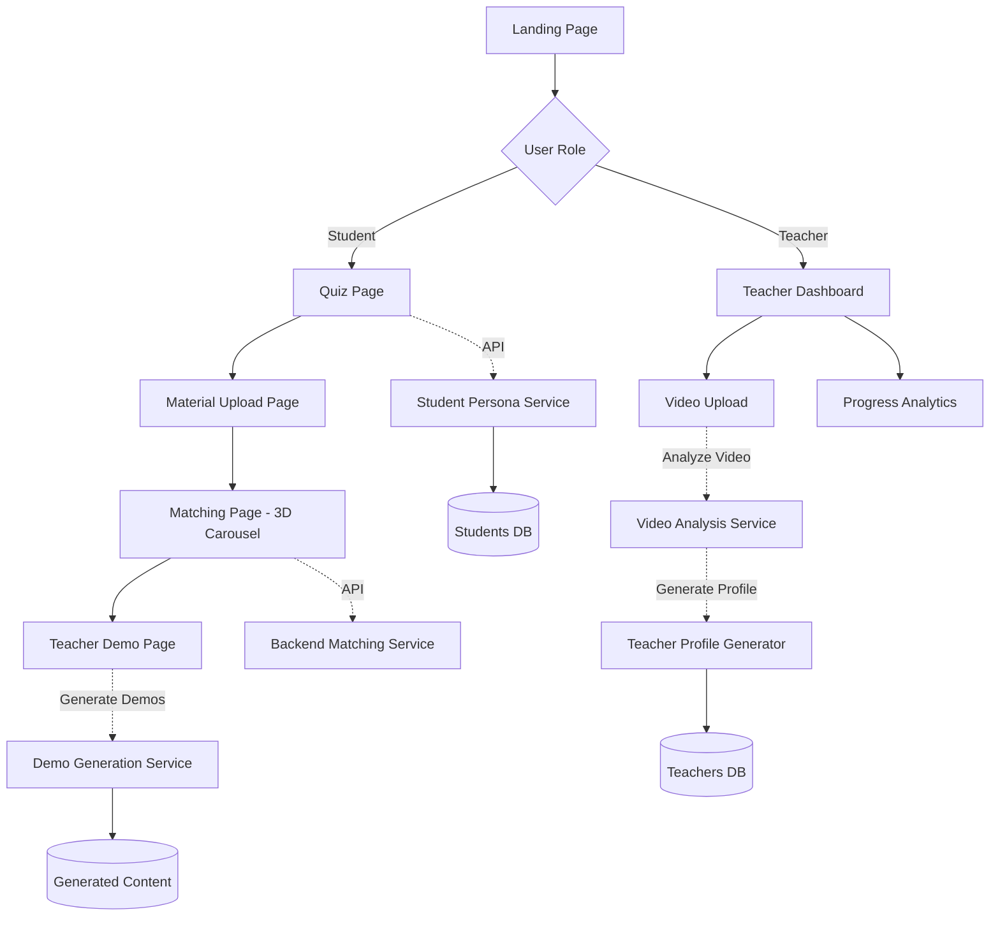

# Design Document: Student-Teacher Matching Platform

## Overview

The Student-Teacher Matching Platform is a web application that helps students discover the best-fit teachers based on their learning preferences. The platform uses a cognitive load assessment quiz to generate a 24-dimension student persona, then matches students with teachers using weighted compatibility scoring. The core experience centers around an immersive 3D carousel interface where students explore teacher matches through realistic wooden university doors.

The platform consists of five main pages: a role selection landing page, an interactive quiz for cognitive profiling, a 3D carousel matching interface, a teacher demo page with AI-generated study materials, and a teacher dashboard for video upload and analytics. Teachers upload teaching videos which the system analyzes to generate their 24-dimension teaching profile. Students upload learning materials (topics/content they want to learn), and the system generates personalized demo content showing how each matched teacher would teach that specific material. This is a presentation MVP focused on core functionality for single user and single teacher scenarios.

## Architecture



## Sequence Diagrams

### Student Matching Flow

```mermaid
sequenceDiagram
    participant S as Student
    participant Q as Quiz Page
    participant M as Material Upload
    participant API as Backend API
    participant C as Matching Page
    participant D as Demo Page
    
    S->>Q: Complete 20-question quiz
    Q->>Q: Calculate 24-dimension persona
    Q->>API: POST /api/students (save persona)
    API-->>Q: student_id
    Q->>M: Navigate to material upload
    S->>M: Upload learning material (topic/content)
    M->>API: POST /api/students/{id}/material
    API-->>M: material_id
    M->>API: POST /api/match (get ranked teachers)
    API-->>M: ranked teacher list
    M->>C: Navigate with persona + matches + material
    C->>C: Render 3D carousel with teachers
    S->>C: Swipe/drag carousel
    C->>C: Animate door transitions
    S->>C: Click center door
    C->>C: Door swing animation
    C->>D: Navigate to teacher demo
    D->>API: POST /api/generate-demos (student + teacher + material)
    API->>API: Generate 3 demo modalities
    API-->>D: study plan, audio URL, video URL
    D->>S: Display demo options
    S->>D: Select study plan
    D->>S: Show AI-generated study plan


### Teacher Dashboard Flow

```mermaid
sequenceDiagram
    participant T as Teacher
    participant D as Dashboard
    participant API as Backend API
    participant V as Video Analysis
    participant S as Storage
    
    T->>D: Access dashboard
    D->>API: GET /api/teachers/{id}/stats
    API-->>D: match count, student list
    D->>T: Display progress bar
    T->>D: Upload teaching video
    D->>API: POST /api/teachers/{id}/video
    API->>S: Store video file
    API->>V: Analyze teaching video
    V->>V: Extract teaching style, pace, tone
    V->>API: Generate 24-dimension teacher profile
    API-->>D: upload success + profile generated
    D->>T: Update progress bar
```

## Components and Interfaces

### Component 1: LandingPage

**Purpose**: Entry point for role selection - allows users to identify as student or teacher

**Interface**:
```typescript
interface LandingPageProps {
  onRoleSelect: (role: 'student' | 'teacher') => void;
}

interface LandingPageState {
  selectedRole: 'student' | 'teacher' | null;
}
```

**Responsibilities**:
- Display clear role selection UI with visual distinction
- Navigate to appropriate flow based on role selection
- Provide brief description of each role's journey

### Component 2: QuizPage

**Purpose**: Administer 20-question cognitive load assessment to generate student persona

**Interface**:
```typescript
interface QuizPageProps {
  questions: Question[];
  onComplete: (persona: StudentPersona) => void;
}

interface Question {
  id: number;
  text: string;
  options: QuestionOption[];
}

interface QuestionOption {
  label: 'A' | 'B' | 'C' | 'D';
  text: string;
  dimensions: Record<string, number>;
}

interface StudentPersona {
  student_id: string;
  name: string;
  generated_at: string;
  persona: Record<string, number>; // 24 dimensions, 0-1 scale
  archetype: string;
  summary: string;
}
```

**Responsibilities**:
- Display questions one at a time with smooth transitions
- Track user responses and accumulate dimension scores
- Calculate final persona by averaging dimension values
- Save persona to backend via API
- Navigate to material upload page with persona data

### Component 3: MaterialUploadPage

**Purpose**: Allow students to upload learning material (topic/content they want to learn)

**Interface**:
```typescript
interface MaterialUploadPageProps {
  studentPersona: StudentPersona;
  onUploadComplete: (materialId: string) => void;
}

interface LearningMaterial {
  material_id: string;
  student_id: string;
  content: string;
  topic: string;
  uploaded_at: string;
}

interface UploadState {
  content: string;
  topic: string;
  isUploading: boolean;
  error: string | null;
}
```

**Responsibilities**:
- Provide text input for learning material/topic
- Validate material content is non-empty
- Upload material to backend via API
- Navigate to matching page after successful upload
- Pass material_id to matching flow for demo generation

### Component 4: MatchingCarousel

**Purpose**: 3D carousel interface displaying teacher matches as wooden university doors

**Interface**:
```typescript
interface MatchingCarouselProps {
  teachers: RankedTeacher[];
  studentPersona: StudentPersona;
  materialId: string;
  onTeacherSelect: (teacher: RankedTeacher) => void;
}

interface RankedTeacher {
  teacher_id: string;
  name: string;
  subject: string;
  archetype: string;
  tagline: string;
  summary: string;
  compatibility_score: number;
  why: {
    best: string[];
    worst: string[];
  };
}

interface CarouselState {
  activeIndex: number;
  isDragging: boolean;
  dragOffset: number;
  isAnimating: boolean;
}
```

**Responsibilities**:
- Render 3 doors at a time (center + 2 sides)
- Apply 3D transforms: center door scale(1.1), side doors scale(0.85) + translateZ(-200px)
- Apply Gaussian blur to side doors: filter: blur(4px)
- Handle drag/swipe gestures for carousel rotation
- Animate smooth transitions between doors (scale, blur, position)
- Display teacher name and match percentage etched on center door
- Trigger door swing animation on center door click
- Navigate to teacher demo page after animation completes

### Component 5: TeacherDemoPage

**Purpose**: Display AI-generated demo content showing how the selected teacher would teach the student's uploaded material

**Interface**:
```typescript
interface TeacherDemoPageProps {
  teacher: RankedTeacher;
  studentPersona: StudentPersona;
  materialId: string;
}

interface DemoContent {
  studyPlan: string;
  audioUrl: string;
  videoUrl: string;
}

interface DemoPageState {
  selectedModality: 'study-plan' | 'audio' | 'video' | null;
  content: DemoContent | null;
  isLoading: boolean;
  isGenerating: boolean;
}
```

**Responsibilities**:
- Display 3 option cards: Study Plan, Teaching Audio, Teaching Video
- Trigger demo generation on page load (student persona + teacher profile + material)
- Show loading state while demos are being generated
- Fetch generated demo content from backend
- Render study plan in formatted view
- Embed audio/video players for respective modalities
- Provide navigation back to carousel

### Component 6: TeacherDashboard

**Purpose**: Teacher interface for video upload and match analytics

**Interface**:
```typescript
interface TeacherDashboardProps {
  teacherId: string;
}

interface TeacherStats {
  teacher_id: string;
  name: string;
  total_matches: number;
  matched_students: StudentMatch[];
  profile_generated: boolean;
}

interface StudentMatch {
  student_id: string;
  student_name: string;
  compatibility_score: number;
  matched_at: string;
}

interface UploadState {
  isUploading: boolean;
  isAnalyzing: boolean;
  progress: number;
  error: string | null;
}
```

**Responsibilities**:
- Display progress bar showing match count
- List matched students with compatibility scores
- Provide video upload interface with progress indicator
- Handle file upload to backend storage
- Trigger video analysis to generate teacher's 24-dimension profile
- Show analysis status (analyzing video, extracting teaching style)
- Update analytics in real-time
- Display profile generation confirmation

## Data Models

### Model 1: StudentPersona

```typescript
interface StudentPersona {
  student_id: string;
  name: string;
  generated_at: string;
  persona: DimensionScores;
  archetype: string;
  summary: string;
}

interface DimensionScores {
  pace: number;
  structure: number;
  abstraction: number;
  interactivity: number;
  visual_dependency: number;
  verbal_density: number;
  repetition_need: number;
  formality: number;
  humor_receptivity: number;
  feedback_style: number;
  autonomy: number;
  cognitive_load_tolerance: number;
  attention_span: number;
  motivation_type: number;
  error_tolerance: number;
  social_preference: number;
  real_world_need: number;
  emotional_sensitivity: number;
  question_comfort: number;
  note_taking_style: number;
  challenge_preference: number;
  context_need: number;
  storytelling_affinity: number;
  revision_style: number;
}
```

**Validation Rules**:
- All dimension scores must be between 0.0 and 1.0
- student_id must follow format: `stu_[8 hex chars]`
- generated_at must be ISO 8601 timestamp
- name must be non-empty string

### Model 2: RankedTeacher

```typescript
interface RankedTeacher {
  teacher_id: string;
  name: string;
  subject: string;
  archetype: string;
  tagline: string;
  summary: string;
  compatibility_score: number;
  why: MatchExplanation;
  persona: DimensionScores;
}

interface MatchExplanation {
  best: string[]; // Top 3 best-matching dimensions
  worst: string[]; // Bottom 2 worst-matching dimensions
}
```

**Validation Rules**:
- teacher_id must follow format: `tch_[subject]_[3 digits]`
- compatibility_score must be between 0 and 100
- why.best must contain exactly 3 dimension names
- why.worst must contain exactly 2 dimension names
- All dimension names must be valid keys from DimensionScores

### Model 3: LearningMaterial

```typescript
interface LearningMaterial {
  material_id: string;
  student_id: string;
  content: string;
  topic: string;
  uploaded_at: string;
}
```

**Validation Rules**:
- material_id must follow format: `mat_[8 hex chars]`
- student_id must be valid and exist in database
- content must be non-empty string
- topic must be non-empty string
- uploaded_at must be ISO 8601 timestamp

### Model 4: TeacherProfile

```typescript
interface TeacherProfile {
  teacher_id: string;
  name: string;
  subject: string;
  archetype: string;
  tagline: string;
  summary: string;
  persona: DimensionScores;
  video_url: string;
  profile_generated_at: string;
}
```

**Validation Rules**:
- teacher_id must follow format: `tch_[subject]_[3 digits]`
- All dimension scores in persona must be between 0.0 and 1.0
- video_url must be valid URL or file path
- profile_generated_at must be ISO 8601 timestamp
- Profile is generated from video analysis, not manually entered

### Model 5: GeneratedDemoContent

### Model 5: GeneratedDemoContent

```typescript
interface GeneratedDemoContent {
  demo_id: string;
  teacher_id: string;
  student_id: string;
  material_id: string;
  content_type: 'study-plan' | 'audio' | 'video';
  content_url: string;
  generated_at: string;
  metadata: DemoMetadata;
}

interface DemoMetadata {
  duration?: number; // for audio/video in seconds
  file_size?: number; // in bytes
  format?: string; // e.g., 'mp4', 'mp3', 'markdown'
  generation_time?: number; // time taken to generate in seconds
}
```

**Validation Rules**:
- demo_id must follow format: `demo_[8 hex chars]`
- content_type must be one of: 'study-plan', 'audio', 'video'
- content_url must be valid URL or file path
- generated_at must be ISO 8601 timestamp
- If content_type is 'audio' or 'video', duration must be provided
- Demo is generated on-the-fly based on: student persona + teacher profile + learning material

## Algorithmic Pseudocode

### Main Processing Algorithm: Generate Student Persona from Quiz

```typescript
function generatePersonaFromQuiz(responses: QuestionResponse[]): StudentPersona {
  // INPUT: Array of question responses with selected options
  // OUTPUT: Complete student persona with 24-dimension scores
  
  const dimensionAccumulator: Record<string, number[]> = {};
  const DIMENSION_KEYS = [
    'pace', 'structure', 'abstraction', 'interactivity', 'visual_dependency',
    'verbal_density', 'repetition_need', 'formality', 'humor_receptivity',
    'feedback_style', 'autonomy', 'cognitive_load_tolerance', 'attention_span',
    'motivation_type', 'error_tolerance', 'social_preference', 'real_world_need',
    'emotional_sensitivity', 'question_comfort', 'note_taking_style',
    'challenge_preference', 'context_need', 'storytelling_affinity', 'revision_style'
  ];
  
  // Initialize accumulator for all dimensions
  for (const key of DIMENSION_KEYS) {
    dimensionAccumulator[key] = [];
  }
  
  // Accumulate dimension values from each response
  for (const response of responses) {
    const selectedOption = response.question.options[response.selectedIndex];
    
    for (const [dimension, value] of Object.entries(selectedOption.dimensions)) {
      if (dimensionAccumulator[dimension]) {
        dimensionAccumulator[dimension].push(value);
      }
    }
  }
  
  // Calculate average for each dimension
  const persona: DimensionScores = {};
  for (const key of DIMENSION_KEYS) {
    const values = dimensionAccumulator[key];
    
    if (values.length === 0) {
      persona[key] = 0.5; // Default neutral value
    } else {
      const sum = values.reduce((acc, val) => acc + val, 0);
      persona[key] = Math.round((sum / values.length) * 100) / 100;
    }
  }
  
  // Generate archetype and summary
  const { archetype, summary } = deriveArchetype(persona);
  
  return {
    student_id: generateStudentId(),
    name: 'Student', // Will be replaced with actual name
    generated_at: new Date().toISOString(),
    persona,
    archetype,
    summary
  };
}
```

**Preconditions**:
- responses array is non-empty
- Each response contains valid question and selectedIndex
- All dimension values in options are between 0.0 and 1.0

**Postconditions**:
- Returns valid StudentPersona object
- All 24 dimensions have values between 0.0 and 1.0
- student_id is unique and properly formatted
- generated_at is valid ISO 8601 timestamp

**Loop Invariants**:
- dimensionAccumulator maintains valid arrays for all dimension keys
- All accumulated values remain between 0.0 and 1.0

### Carousel Rotation Algorithm

```typescript
function rotateCarousel(
  currentIndex: number,
  direction: 'left' | 'right',
  teachers: RankedTeacher[]
): CarouselTransition {
  // INPUT: Current center index, rotation direction, teacher list
  // OUTPUT: Transition state with new positions and transforms
  
  const totalTeachers = teachers.length;
  const newIndex = direction === 'right' 
    ? (currentIndex + 1) % totalTeachers
    : (currentIndex - 1 + totalTeachers) % totalTeachers;
  
  // Calculate positions for 3 visible doors
  const leftIndex = (newIndex - 1 + totalTeachers) % totalTeachers;
  const centerIndex = newIndex;
  const rightIndex = (newIndex + 1) % totalTeachers;
  
  // Define transforms for each position
  const transforms = {
    left: {
      scale: 0.85,
      translateX: -400,
      translateZ: -200,
      blur: 4,
      opacity: 0.7
    },
    center: {
      scale: 1.1,
      translateX: 0,
      translateZ: 0,
      blur: 0,
      opacity: 1.0
    },
    right: {
      scale: 0.85,
      translateX: 400,
      translateZ: -200,
      blur: 4,
      opacity: 0.7
    }
  };
  
  return {
    newIndex: centerIndex,
    positions: {
      [leftIndex]: transforms.left,
      [centerIndex]: transforms.center,
      [rightIndex]: transforms.right
    },
    duration: 600 // milliseconds
  };
}
```

**Preconditions**:
- currentIndex is valid (0 <= currentIndex < teachers.length)
- teachers array is non-empty
- direction is either 'left' or 'right'

**Postconditions**:
- newIndex is valid and different from currentIndex
- All position indices are within valid range
- Transform values are properly defined for all visible doors
- Transition duration is positive

**Loop Invariants**: N/A (no loops in this function)

### Matching Score Calculation Algorithm

```typescript
function calculateCompatibilityScore(
  studentPersona: DimensionScores,
  teacherPersona: DimensionScores
): MatchResult {
  // INPUT: Student and teacher 24-dimension personas
  // OUTPUT: Compatibility score (0-100) and dimension explanations
  
  const DIMENSION_KEYS = Object.keys(studentPersona);
  
  // Dimension weights: 3x (critical), 2x (important), 1x (nice to have)
  const WEIGHT_3X = new Set([
    'pace', 'cognitive_load_tolerance', 'verbal_density', 'structure'
  ]);
  const WEIGHT_2X = new Set([
    'interactivity', 'abstraction', 'feedback_style', 
    'autonomy', 'real_world_need', 'attention_span'
  ]);
  
  function getWeight(dimension: string): number {
    if (WEIGHT_3X.has(dimension)) return 3.0;
    if (WEIGHT_2X.has(dimension)) return 2.0;
    return 1.0;
  }
  
  // Calculate weighted Manhattan distance
  let totalDistance = 0;
  const contributions: Array<[string, number]> = [];
  
  for (const dimension of DIMENSION_KEYS) {
    const studentValue = studentPersona[dimension];
    const teacherValue = teacherPersona[dimension];
    const weight = getWeight(dimension);
    const contribution = weight * Math.abs(studentValue - teacherValue);
    
    totalDistance += contribution;
    contributions.push([dimension, contribution]);
  }
  
  // Convert distance to 0-100 score (lower distance = higher score)
  const score = Math.round(100 / (1 + totalDistance) * 100) / 100;
  
  // Sort contributions to find best and worst matches
  contributions.sort((a, b) => a[1] - b[1]);
  
  const bestDimensions = contributions.slice(0, 3).map(([dim]) => dim);
  const worstDimensions = contributions.slice(-2).map(([dim]) => dim).reverse();
  
  return {
    compatibility_score: score,
    why: {
      best: bestDimensions,
      worst: worstDimensions
    }
  };
}
```

**Preconditions**:
- Both studentPersona and teacherPersona contain all 24 dimensions
- All dimension values are between 0.0 and 1.0
- Dimension keys match between student and teacher personas

**Postconditions**:
- compatibility_score is between 0 and 100
- why.best contains exactly 3 dimension names
- why.worst contains exactly 2 dimension names
- Lower distance results in higher score

**Loop Invariants**:
- totalDistance accumulates only non-negative values
- contributions array maintains valid [dimension, contribution] pairs
- All contribution values are non-negative

## Key Functions with Formal Specifications

### Function 1: handleCarouselDrag()

```typescript
function handleCarouselDrag(
  startX: number,
  currentX: number,
  threshold: number
): DragResult
```

**Preconditions:**
- startX and currentX are valid screen coordinates
- threshold is positive number (typically 100-150 pixels)
- Drag gesture has been initiated

**Postconditions:**
- Returns drag offset for visual feedback
- If |currentX - startX| > threshold, triggers rotation
- Rotation direction matches drag direction
- No state mutation until drag completes

**Loop Invariants:** N/A

### Function 2: animateDoorSwing()

```typescript
function animateDoorSwing(
  doorElement: HTMLElement,
  onComplete: () => void
): Animation
```

**Preconditions:**
- doorElement is valid DOM element representing center door
- onComplete is valid callback function
- Door is in center position (not animating)

**Postconditions:**
- Returns Animation object for control
- Door rotates on Y-axis from 0deg to 90deg
- Animation duration is 800ms with ease-out timing
- onComplete callback fires after animation completes
- Navigation to demo page occurs after callback

**Loop Invariants:** N/A

### Function 3: generateDemoContent()

```typescript
async function generateDemoContent(
  studentPersona: StudentPersona,
  teacherProfile: TeacherProfile,
  material: LearningMaterial
): Promise<DemoContent>
```

**Preconditions:**
- studentPersona contains valid 24-dimension scores
- teacherProfile contains valid 24-dimension scores
- material contains non-empty content and topic
- All three parameters are properly validated

**Postconditions:**
- Returns DemoContent with 3 modalities (study plan, audio URL, video URL)
- Study plan is formatted markdown text
- Audio and video URLs point to generated content files
- Generation uses AI to combine student's learning style + teacher's teaching style + material content
- All generated content is stored in backend storage
- If generation fails, throws exception with descriptive message

**Loop Invariants:** N/A

### Function 4: analyzeTeachingVideo()

```typescript
async function analyzeTeachingVideo(
  videoFile: File,
  teacherId: string
): Promise<TeacherProfile>
```

**Preconditions:**
- videoFile is valid video file (mp4, webm, or mov)
- teacherId is valid and exists in database
- Video contains teaching content (not empty or corrupted)

**Postconditions:**
- Returns TeacherProfile with generated 24-dimension persona
- Persona dimensions extracted from video analysis (teaching style, pace, tone, etc.)
- Profile is saved to database
- Video is stored in backend storage
- If analysis fails, throws exception with descriptive message

**Loop Invariants:** N/A

## Example Usage

### Example 1: Complete Student Flow

```typescript
// Student completes quiz
const quizPage = new QuizPage({
  questions: QUESTIONS,
  onComplete: async (persona) => {
    // Save persona to backend
    const response = await fetch('/api/students', {
      method: 'POST',
      headers: { 'Content-Type': 'application/json' },
      body: JSON.stringify(persona)
    });
    
    const savedStudent = await response.json();
    
    // Navigate to material upload
    router.push({
      pathname: '/upload-material',
      query: { studentId: savedStudent.student_id }
    });
  }
});

// Student uploads learning material
const materialPage = new MaterialUploadPage({
  studentPersona: currentStudent,
  onUploadComplete: async (materialId) => {
    // Get matched teachers
    const matchResponse = await fetch('/api/match', {
      method: 'POST',
      headers: { 'Content-Type': 'application/json' },
      body: JSON.stringify({
        studentPersona: currentStudent.persona,
        subject: null // No filter
      })
    });
    
    const { ranked } = await matchResponse.json();
    
    // Navigate to carousel
    router.push({
      pathname: '/match',
      query: { 
        studentId: currentStudent.student_id,
        materialId: materialId,
        teachers: JSON.stringify(ranked)
      }
    });
  }
});
```

### Example 2: Carousel Interaction and Demo Generation

```typescript
// Initialize carousel
const carousel = new MatchingCarousel({
  teachers: rankedTeachers,
  studentPersona: currentStudent,
  materialId: currentMaterialId,
  onTeacherSelect: (teacher) => {
    // Animate door swing
    const doorElement = document.querySelector('.center-door');
    animateDoorSwing(doorElement, () => {
      // Navigate to demo page
      router.push({
        pathname: '/demo',
        query: {
          teacherId: teacher.teacher_id,
          studentId: currentStudent.student_id,
          materialId: currentMaterialId
        }
      });
    });
  }
});

// Demo page - generate content on load
const demoPage = new TeacherDemoPage({
  teacher: selectedTeacher,
  studentPersona: currentStudent,
  materialId: currentMaterialId
});

async function loadDemoContent() {
  demoPage.setState({ isGenerating: true });
  
  // Generate demos based on student + teacher + material
  const response = await fetch('/api/generate-demos', {
    method: 'POST',
    headers: { 'Content-Type': 'application/json' },
    body: JSON.stringify({
      studentId: currentStudent.student_id,
      teacherId: selectedTeacher.teacher_id,
      materialId: currentMaterialId
    })
  });
  
  const demoContent: DemoContent = await response.json();
  
  demoPage.setState({ 
    content: demoContent,
    isGenerating: false 
  });
  
  // Display demo options
  displayDemoOptions(demoContent);
}

// Handle drag gesture
carousel.onDragStart = (e) => {
  carousel.setState({ isDragging: true, dragStartX: e.clientX });
};

carousel.onDragMove = (e) => {
  if (!carousel.state.isDragging) return;
  
  const offset = e.clientX - carousel.state.dragStartX;
  carousel.setState({ dragOffset: offset });
  
  // Visual feedback: translate carousel
  carousel.element.style.transform = `translateX(${offset}px)`;
};

carousel.onDragEnd = (e) => {
  const offset = e.clientX - carousel.state.dragStartX;
  const threshold = 150;
  
  if (Math.abs(offset) > threshold) {
    const direction = offset > 0 ? 'left' : 'right';
    carousel.rotate(direction);
  } else {
    // Snap back to center
    carousel.element.style.transform = 'translateX(0)';
  }
  
  carousel.setState({ isDragging: false, dragOffset: 0 });
};
```

### Example 3: Teacher Dashboard with Video Analysis

```typescript
// Initialize teacher dashboard
const dashboard = new TeacherDashboard({
  teacherId: 'tch_bio_001'
});

// Fetch and display stats
async function loadStats() {
  const response = await fetch(`/api/teachers/${dashboard.teacherId}/stats`);
  const stats: TeacherStats = await response.json();
  
  // Update progress bar
  const progressBar = document.querySelector('.progress-bar');
  progressBar.style.width = `${(stats.total_matches / 100) * 100}%`;
  progressBar.textContent = `${stats.total_matches} students matched`;
  
  // Show profile status
  if (stats.profile_generated) {
    document.querySelector('.profile-status').textContent = 'Profile Generated ✓';
  }
  
  // Display matched students
  const studentList = document.querySelector('.student-list');
  stats.matched_students.forEach(student => {
    const item = document.createElement('div');
    item.className = 'student-item';
    item.innerHTML = `
      <span>${student.student_name}</span>
      <span>${student.compatibility_score}% match</span>
    `;
    studentList.appendChild(item);
  });
}

// Handle video upload and analysis
async function handleVideoUpload(file: File) {
  dashboard.setState({ isUploading: true });
  
  // Upload video
  const uploadResponse = await fetch(`/api/teachers/${dashboard.teacherId}/video`, {
    method: 'POST',
    body: file
  });
  
  if (!uploadResponse.ok) {
    alert('Upload failed');
    return;
  }
  
  dashboard.setState({ 
    isUploading: false,
    isAnalyzing: true 
  });
  
  // Analyze video to generate teacher profile
  const analysisResponse = await fetch(`/api/teachers/${dashboard.teacherId}/analyze`, {
    method: 'POST'
  });
  
  const profile: TeacherProfile = await analysisResponse.json();
  
  dashboard.setState({ isAnalyzing: false });
  
  alert('Video analyzed! Your teaching profile has been generated.');
  loadStats(); // Refresh stats
}
```

## Correctness Properties

*A property is a characteristic or behavior that should hold true across all valid executions of a system—essentially, a formal statement about what the system should do. Properties serve as the bridge between human-readable specifications and machine-verifiable correctness guarantees.*

### Property 1: Persona Completeness and Validity

*For any* generated student persona, all 24 cognitive dimensions must be present with valid scores between 0.0 and 1.0 inclusive, rounded to 2 decimal places, with no undefined values.

**Validates: Requirements 3.1, 3.4, 3.5, 18.1, 18.2**

### Property 2: Dimension Averaging Correctness

*For any* quiz completion, each dimension score must equal the average of all contributing values from selected answer options, or 0.5 if no contributing values exist.

**Validates: Requirements 3.2, 3.3**

### Property 3: Persona Metadata Validity

*For any* generated student persona, the student_id must follow format "stu_[8 hex chars]", the archetype must be non-empty, the summary must be non-empty, and the generated_at timestamp must be valid ISO 8601 format.

**Validates: Requirements 3.6, 3.7, 3.8, 3.9**

### Property 4: Question Format Consistency

*For any* quiz question displayed, it must present exactly 4 answer options labeled A, B, C, and D.

**Validates: Requirement 2.2**

### Property 5: Quiz Response Recording

*For any* answer selection during the quiz, the system must record the response and advance to the next question.

**Validates: Requirement 2.3**

### Property 6: Quiz Validation

*For any* quiz submission attempt with unanswered questions, the system must display a validation error and prevent submission.

**Validates: Requirement 2.4**

### Property 7: Single Question Display

*For any* quiz state, only one question must be visible at a time.

**Validates: Requirement 2.6**

### Property 8: Compatibility Score Calculation

*For any* student-teacher pair, the compatibility score must be calculated using weighted Manhattan distance with dimension weights of 3x for critical dimensions (pace, cognitive_load_tolerance, verbal_density, structure), 2x for important dimensions (interactivity, abstraction, feedback_style, autonomy, real_world_need, attention_span), and 1x for all others, then converted to a 0-100 score using the formula: score = 100 / (1 + totalDistance), rounded to 2 decimal places.

**Validates: Requirements 5.2, 5.3, 5.4**

### Property 9: Teacher Ranking Order

*For any* ranked teacher list, teachers must be sorted by compatibility score in descending order (highest scores first).

**Validates: Requirement 5.5**

### Property 10: Match Explanation Completeness

*For any* teacher match, the explanation must identify exactly 3 best-matching dimensions (lowest weighted distance) and exactly 2 worst-matching dimensions (highest weighted distance), and the output must include compatibility score and complete match explanation.

**Validates: Requirements 5.6, 5.7, 5.8**

### Property 11: Center Door Display

*For any* teacher in the center carousel position, the door must display the teacher's name and compatibility percentage.

**Validates: Requirement 6.6**

### Property 12: Carousel Wraparound Navigation

*For any* carousel with N teachers, rotating right from index i must display teacher at index (i + 1) % N, and rotating left from index i must display teacher at index (i - 1 + N) % N.

**Validates: Requirements 6.7, 8.2, 8.3**

### Property 13: Drag Offset Tracking

*For any* drag gesture on the carousel, the system must track the horizontal drag offset from the starting position.

**Validates: Requirement 7.1**

### Property 14: Drag Visual Feedback

*For any* horizontal drag on the carousel, the system must provide visual feedback by translating the carousel by the drag offset.

**Validates: Requirement 7.2**

### Property 15: Drag Threshold Rotation

*For any* drag release with offset greater than 150 pixels, the carousel must rotate in the drag direction; for any drag release with offset ≤ 150 pixels, the carousel must snap back to center.

**Validates: Requirements 7.3, 7.4**

### Property 16: Carousel Rotation Consistency

*For any* carousel state, rotating right then immediately rotating left must return to the original center teacher (round-trip property).

**Validates: Requirement 8.1**

### Property 17: Carousel Index Validity

*For any* carousel state with N teachers, the active index must be within the range [0, N-1] at all times.

**Validates: Requirement 8.4**

### Property 18: Student List Display Completeness

*For any* matched student displayed in the teacher dashboard, the display must include the student's name and compatibility score.

**Validates: Requirement 11.4**

### Property 19: Student List Sorting

*For any* student list in the teacher dashboard, students must be sorted by compatibility score in descending order.

**Validates: Requirement 11.5**

### Property 20: File Type Validation

*For any* video file selection, the system must validate the file type and accept only mp4, webm, and mov formats.

**Validates: Requirement 12.2**

### Property 21: File Size Validation

*For any* video file selection, the system must validate that the file size is less than 500MB.

**Validates: Requirement 12.3**

### Property 22: Validation Error Specificity

*For any* file validation failure, the system must display a specific error message indicating the exact validation failure reason (file type, file size, etc.).

**Validates: Requirement 12.4**

### Property 23: Upload Progress Range and Monotonicity

*For any* upload session, all progress callback values must be between 0 and 100 inclusive, and the sequence of progress values must be monotonically increasing (each value ≥ previous value).

**Validates: Requirements 13.1, 13.2**

### Property 24: ID Format Validation

*For any* student_id, it must follow format "stu_[8 hex chars]"; for any teacher_id, it must follow format "tch_[subject]_[3 digits]".

**Validates: Requirements 14.1, 14.2**

### Property 25: Score Range Validation

*For any* dimension score, it must be between 0.0 and 1.0 inclusive; for any compatibility score, it must be between 0 and 100.

**Validates: Requirements 14.3, 14.4**

### Property 26: Timestamp Format Validation

*For any* generated_at or created_at timestamp, it must be valid ISO 8601 format.

**Validates: Requirement 14.5**

### Property 27: Match Explanation Validation

*For any* match explanation, the "best" array must contain exactly 3 dimension names, the "worst" array must contain exactly 2 dimension names, and all dimension names must be valid dimension keys from the 24-dimension set.

**Validates: Requirements 14.6, 14.7, 14.8**

### Property 28: Dimension Completeness in Matching

*For any* matching operation, both the student persona and teacher persona must contain all 24 dimensions before compatibility calculation proceeds.

**Validates: Requirements 18.3, 18.4**

### Property 29: Content Metadata Completeness

*For any* stored demo content, it must include file size in bytes, file format, and valid ISO 8601 generated_at timestamp; for any audio or video content, it must additionally include duration in seconds.

**Validates: Requirements 20.1, 20.2, 20.3, 20.4, 20.5, 20.6**

### Property 30: Material Upload Validation

*For any* learning material upload, the content must be non-empty, the topic must be non-empty, and the material_id must follow format "mat_[8 hex chars]".

**Validates: Material upload requirements**

### Property 31: Demo Generation Completeness

*For any* demo generation request, the system must generate exactly 3 modalities (study plan, audio, video) based on the combination of student persona, teacher profile, and learning material.

**Validates: Demo generation requirements**

### Property 32: Teacher Profile Generation

*For any* uploaded teaching video, the system must analyze the video and generate a teacher profile with all 24 dimensions between 0.0 and 1.0, extracted from teaching style, pace, tone, and other characteristics.

**Validates: Teacher video analysis requirements**

### Property 33: Demo Content Association

*For any* generated demo content, it must be associated with a valid student_id, teacher_id, and material_id, ensuring traceability of which student's material was used for which teacher's demo.

**Validates: Demo content tracking requirements**

## Error Handling

### Error Scenario 1: Quiz Incomplete Submission

**Condition**: User attempts to submit quiz with unanswered questions
**Response**: Display validation error highlighting unanswered questions
**Recovery**: Allow user to complete remaining questions before proceeding

### Error Scenario 2: Material Upload Validation

**Condition**: User attempts to upload empty or invalid learning material
**Response**: Display validation error indicating content is required
**Recovery**: Allow user to enter valid material content before proceeding

### Error Scenario 3: API Matching Failure

**Condition**: Backend matching API returns error or times out
**Response**: Display user-friendly error message with retry option
**Recovery**: Cache student persona and material locally, allow retry without re-taking quiz

### Error Scenario 4: Demo Generation Failure

**Condition**: AI demo generation fails or times out
**Response**: Display error message indicating generation failed
**Recovery**: Allow user to retry generation or return to carousel to select different teacher

### Error Scenario 5: Carousel Drag Conflict

**Condition**: User initiates drag while carousel is animating
**Response**: Ignore new drag gesture until current animation completes
**Recovery**: Queue gesture or discard based on animation state

### Error Scenario 6: Video Upload Failure

**Condition**: Network error or file validation failure during upload
**Response**: Display specific error message (network, file size, format)
**Recovery**: Allow user to retry upload with same or different file

### Error Scenario 7: Video Analysis Failure

**Condition**: Video analysis service fails to extract teaching profile
**Response**: Display error message indicating analysis failed
**Recovery**: Allow teacher to re-upload video or try different video

### Error Scenario 8: Invalid Teacher Selection

**Condition**: User clicks door for teacher with no profile generated
**Response**: Display message indicating teacher profile not yet available
**Recovery**: Allow user to return to carousel and select different teacher

## Testing Strategy

### Unit Testing Approach

Test individual functions and components in isolation:

- **Persona Generation**: Test `generatePersonaFromQuiz()` with various response patterns, verify all dimensions calculated correctly, edge cases (no responses, all same answer)
- **Matching Algorithm**: Test `calculateCompatibilityScore()` with known student/teacher pairs, verify score calculation, dimension weighting, best/worst identification
- **Carousel Math**: Test `rotateCarousel()` with different indices and directions, verify wraparound behavior, position calculations
- **Demo Generation**: Test `generateDemoContent()` with various student/teacher/material combinations, verify all 3 modalities generated
- **Video Analysis**: Test `analyzeTeachingVideo()` with sample videos, verify profile extraction
- **Validation Functions**: Test input validation for all data models, verify rejection of invalid data

**Coverage Goals**: 90%+ line coverage, 100% coverage of critical paths (matching, persona generation, demo generation)

### Property-Based Testing Approach

Use property-based testing to verify invariants across random inputs:

**Property Test Library**: fast-check (for TypeScript/JavaScript)

**Key Properties to Test**:
1. Persona dimension values always in [0, 1] range regardless of quiz responses
2. Carousel rotation is reversible (right then left returns to start)
3. Match scores are commutative (score(A, B) = score(B, A))
4. Ranked teacher lists are always sorted by score descending
5. Demo generation always produces 3 modalities (study plan, audio, video)
6. Teacher profile dimensions always in [0, 1] range after video analysis

**Example Property Test**:
```typescript
import fc from 'fast-check';

test('persona dimensions always in valid range', () => {
  fc.assert(
    fc.property(
      fc.array(fc.record({
        questionId: fc.integer(1, 20),
        selectedIndex: fc.integer(0, 3)
      }), { minLength: 20, maxLength: 20 }),
      (responses) => {
        const persona = generatePersonaFromQuiz(responses);
        return Object.values(persona.persona).every(
          value => value >= 0 && value <= 1
        );
      }
    )
  );
});
```

### Integration Testing Approach

Test complete user flows end-to-end:

- **Student Flow**: Quiz completion → persona generation → material upload → API save → matching → carousel display → teacher selection → demo generation → demo page
- **Teacher Flow**: Dashboard load → stats display → video upload → video analysis → profile generation → progress update
- **API Integration**: Test all API endpoints with realistic data, verify error handling, response formats
- **3D Carousel**: Test drag gestures, animations, door transitions with real DOM elements
- **Demo Generation**: Test end-to-end demo generation with real student/teacher/material data

## Performance Considerations

**Carousel Rendering**: Use CSS transforms (translateZ, scale) instead of position changes for 60fps animations. Implement virtual scrolling if teacher list exceeds 50 items - only render visible doors + 2 on each side.

**Quiz State Management**: Store responses in memory during quiz, batch save to backend only on completion.

**Matching Calculation**: Matching algorithm is O(n × m) where n = teachers, m = dimensions (24). With ~30 teachers, this is negligible. For MVP, no optimization needed.

**Video Upload**: For MVP, simple upload without chunking. Show progress indicator during upload and analysis.

**Demo Generation**: Generate demos on-demand when student clicks teacher door. Show loading state during generation (may take 10-30 seconds for all 3 modalities). Cache generated demos to avoid regeneration.

**Video Analysis**: Teacher video analysis may take 1-2 minutes. Show progress indicator and status messages (uploading, analyzing, extracting profile).

**Image Assets**: Use WebP format for door textures with fallback to PNG. Implement lazy loading for teacher profile images. Target < 2MB total asset size for carousel page.

## Dependencies

**Frontend**:
- Next.js 14+ (React framework)
- TypeScript 5+ (type safety)
- Framer Motion (animations, door swing, carousel transitions)
- React Three Fiber (optional: for enhanced 3D effects)
- Tailwind CSS (styling)
- shadcn/ui (UI components)

**Backend**:
- FastAPI (existing Python backend)
- Python 3.10+ (existing matching logic)
- OpenAI API (content generation for demos)
- Azure Cognitive Services or similar (TTS/video generation for demos)
- Video analysis service (for extracting teaching style from teacher videos)

**Storage**:
- Azure Blob Storage or AWS S3 (video file storage, generated demo content)
- PostgreSQL or MongoDB (student/teacher data persistence)

**Development**:
- fast-check (property-based testing)
- Jest (unit testing)
- Playwright (E2E testing)
- ESLint + Prettier (code quality)

## MVP Simplifications

This is a presentation MVP focused on core functionality:

- No authentication or authorization
- No rate limiting or API throttling
- No malware scanning for uploaded files
- No XSS prevention or CSP headers
- No GDPR compliance features
- Single user and single teacher scenario
- Simplified error handling
- No data encryption or privacy controls

Focus is on demonstrating the matching algorithm, 3D carousel interface, and AI-generated demo content generation flow.
